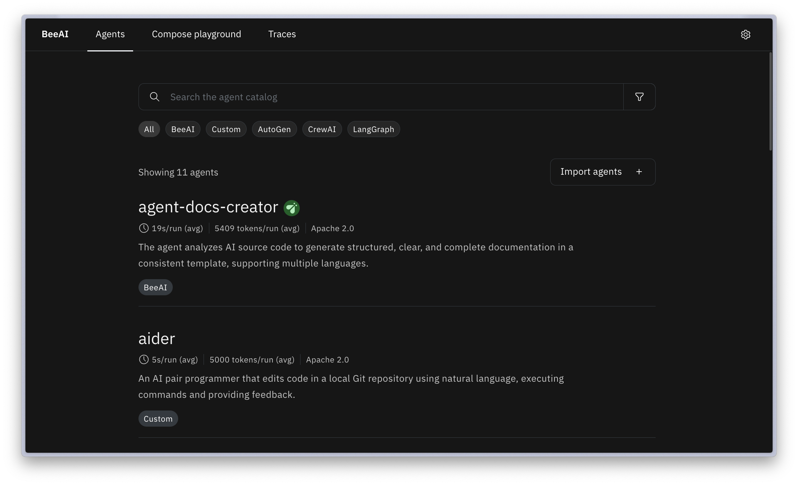
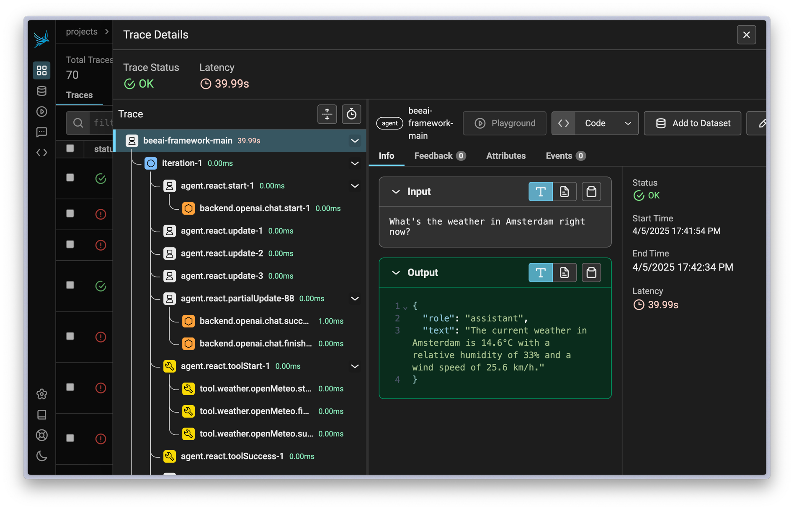

<h1 align="center">
  <picture>
    <source media="(prefers-color-scheme: dark)" srcset="https://raw.githubusercontent.com/i-am-bee/beeai/master/docs/logo/beeai_logo_white.svg">
    <source media="(prefers-color-scheme: light)" srcset="https://raw.githubusercontent.com/i-am-bee/beeai/master/docs/logo/beeai_logo_black.svg">
    <br><br>
  </picture>
  BeeAI
</h1>

# beeai-workshop

## Quickstart

**1. Install the beeai platform**

```shell
brew install i-am-bee/beeai/beeai

# Check that the beeai service started by listing available agents
# (might take a few minutes)

beeai agent list
```

<details>
  <summary>Example output</summary>

```
NAME                    STATUS         DESCRIPTION                     UI         LOCATION                                                 MISSING ENV  LAST ERROR
agent-docs-creator      ready          The agent analyzes AI source …  hands-off  official/agent-docs-creator:agents-v0.0.71               <none>       <none>
aider                   ready          An AI pair programmer that ed…  hands-off  community/aider:agents-v0.0.71                           <none>       <none>
beeai-supervisor        ready          The agent autonomously breaks…  <none>     official/beeai-supervisor:agents-v0.0.71                 <none>       <none>
chat                    ready          The agent is an AI-powered co…  chat       official/beeai-framework/chat:agents-v0.0.71             <none>       <none>
content-judge           ready          Evaluates multiple documents …  custom     official/beeai-framework/content-judge:agents-v0.0.71    <none>       <none>
gpt-researcher          ready          The agent conducts in-depth l…  hands-off  community/gpt-researcher:agents-v0.0.71                  <none>       <none>
literature-review       ready          This agent automates deep web…  hands-off  community/literature-review:agents-v0.0.71               <none>       <none>
marketing-strategy      ready          The agent performs comprehens…  hands-off  community/marketing-strategy:agents-v0.0.71              <none>       <none>
ollama-deep-researcher  ready          The agent performs AI-driven …  hands-off  community/ollama-deep-researcher:agents-v0.0.71          <none>       <none>
podcast-creator         ready          The agent creates structured …  hands-off  official/beeai-framework/podcast-creator:agents-v0.0.71  <none>       <none>
sequential-workflow     ready          The agent orchestrates a sequ…  <none>     official/sequential-workflow:agents-v0.0.71              <none>       <none>
```

</details>

**2. Configure environment**

```shell
beeai env setup

# Use your preferred provider or Choose *Other*
# Enter URL: <TBD>
# Enter API key: <Shown during workshop>
```

<details>
  <summary>Example output</summary>

```
? Select LLM provider: Other               🔧 provide API URL
? Enter the base URL of your API (OpenAI-compatible): http://localhost:4000/v1
? Enter API key: **************
? Select a model (type to filter): beeai-workshop

You're all set! (You can re-run this setup anytime with beeai env setup)
```

</details>

### Using agents

The beeai platform catalog comes with a bunch of agents out of the box. These are implemented in different frameworks
(and even programming languages) -- beeai-framework, crewai, langgraph just to name a few! You can interact with
all of them using a standardized interface and combine them in a workflow.

To interact with an agent, use `beeai run <agent-name>`, for example

```shell
beeai run chat
```

<details>
  <summary>Example output</summary>

```
How can I help you?

>>> /set tools ["weather"]
Config:
{'tools': ['weather']}

>>> What's the weather in Amsterdam right now?

Log: {
  "key": "thought",
  "value": "To determine the current weather in Amsterdam, I need to retrieve the current weather forecast for Amsterdam, so I will use the OpenMeteo function with
the location set to Amsterdam."
}
Log: {
  "key": "tool_name",
  "value": "OpenMeteo"
}
Log: {
  "key": "tool_input",
  "value":
"{\"location\":{\"name\":\"Amsterdam\",\"country\":\"Netherlands\",\"language\":\"English\"},\"start_date\":\"2025-04-05\",\"end_date\":\"2025-04-05\",\"temperatur
e_unit\":\"celsius\"}"
}
Log: {
  "key": "tool_output",
  "value":
"{\"current_units\":{\"time\":\"iso8601\",\"interval\":\"seconds\",\"temperature_2m\":\"°C\",\"rain\":\"mm\",\"relative_humidity_2m\":\"%\",\"wind_speed_10m\":\"km
/h\"},\"current\":{\"time\":\"2025-04-05T15:30\",\"interval\":900,\"temperature_2m\":14.6,\"rain\":0,\"relative_humidity_2m\":33,\"wind_speed_10m\":25.6},\"daily_u
nits\":{\"time\":\"iso8601\",\"temperature_2m_max\":\"°C\",\"temperature_2m_min\":\"°C\",\"rain_sum\":\"mm\"},\"daily\":{\"time\":[\"2025-04-05\"],\"temperature_2m
_max\":[15.1],\"temperature_2m_min\":[7.8],\"rain_sum\":[0]}}"
}
The current weather in Amsterdam is 14.6°C with a relative humidity of 33% and a wind speed of 25.6 km/h.
```

</details>

You can also open the UI and use web interface to chat with agents and get more
information.

```shell
beeai ui
```



### Composing agents

You can try to compose multiple agents into a sequential workflow:

```shell
beeai compose sequential
```

<details>
  <summary>Example output</summary>

```
─────────────────────────────────────────────────────────────────────── Configure Workflow ────────────────────────────────────────────────────────────────────────
Agent: gpt-researcher
Instruction: IBM TechXchange
···································································································································································
Agent: podcast-creator
Instruction: Create podcast about the conducted research
···································································································································································
Agent:  Select agent (Leave empty to execute)
───────────────────────────────────────────────────────────────────────────────────────────────────────────────────────────────────────────────────────────────────

Log: ✅ Agent gpt-researcher[0] started processing
Log: 🔍 Starting the research task for 'IBM TechXchange'...
Log: 🤖 Tech Agent
Log: 🌐 Browsing the web to learn more about the task: IBM TechXchange...
Log: 🤔 Planning the research strategy and subtasks...
Log: 🗂️ I will conduct my research based on the following queries: ['IBM TechXchange 2025 agenda', 'IBM TechXchange Community benefits', 'IBM TechXchange conference
registration', 'IBM TechXchange AI developer tooling', 'IBM TechXchange']...
Log: 🔍 Running research for 'IBM TechXchange 2025 agenda'...
Log: 🔍 Running research for 'IBM TechXchange Community benefits'...
Log: 🔍 Running research for 'IBM TechXchange conference registration'...
Log: 🔍 Running research for 'IBM TechXchange AI developer tooling'...
Log: 🔍 Running research for 'IBM TechXchange'...
Log: ✅ Added source url to research: https://www.ibm.com/community/ibm-techxchange-conference/
Log: ✅ Added source url to research: https://developer.ibm.com/articles/virtual-agents-techxchange-dev-day/
Log: ✅ Added source url to research: https://www.ibm.com/community/techxchange/
Log: ✅ Added source url to research: https://community.ibm.com/community/user/blogs/sarah-jane-cogley/2025/04/02/ibm-techxchange-2025-registration-is-open
Log: ✅ Added source url to research: https://community.ibm.com/community/user/my-community
Log: ✅ Added source url to research: https://developer.ibm.com/events/ibm-techxchange-developer-day-virtual-agents
Log: ✅ Added source url to research: https://www.ibm.com/community/techxchange-events/
Log: ✅ Added source url to research: https://reg.tools.ibm.com/flow/ibm/techxchange24/reg/form/contactInfo
Log: ✅ Added source url to research: https://developer.ibm.com/events/ibm-techxchange-dev-day-ai-dallas
Log: 🤔 Researching for relevant information across multiple sources...
Log: ✅ Added source url to research: https://www.ibm.com/account/reg/us-en/subscribe?formid=urx-53265
Log: 🤔 Researching for relevant information across multiple sources...
Log: 🌐 Scraping content from 4 URLs...
Log: 🤔 Researching for relevant information across multiple sources...
Log: 🌐 Scraping content from 4 URLs...
Log: 📄 Scraped 4 pages of content
Log: ✅ Added source url to research:
https://community.ibm.com/community/user/wasdevops/events/event-description?CalendarEventKey=9266b878-7973-4c9f-a9e5-019403c7ad2c&CommunityKey=1348d157-c61b-417f-9
28a-179c3d0ffccb&Home=/higherlogic/ccadmin/admin/events/managecalendarevents.aspx
Log: ✅ Added source url to research: https://www.ibm.com/community/user-groups-benefits/
Log: 🌐 Scraping content from 2 URLs...
Log: 📄 Scraped 1 pages of content
Log: 🖼️ Selected 0 new images from 0 total images
Log: ✅ Added source url to research: https://www.ibm.com/events/
Log: ✅ Added source url to research: https://www.ibm.com/community/champions-program/
Log: 📄 Scraped 0 pages of content
Log: 🖼️ Selected 1 new images from 1 total images
Log: 🌐 Scraping complete
Log: 🤔 Researching for relevant information across multiple sources...
Log: ✅ Added source url to research: https://community.ibm.com/community/about-us
Log: 🖼️ Selected 0 new images from 0 total images
Log: 🌐 Scraping complete
Log: 📚 Getting relevant content based on query: IBM TechXchange...
Log: 🌐 Scraping content from 2 URLs...
Log: 🤔 Researching for relevant information across multiple sources...
Log: 🌐 Scraping complete
Log: 📚 Getting relevant content based on query: IBM TechXchange AI developer tooling...
Log: 📄 Scraped 2 pages of content
Log: 🌐 Scraping content from 3 URLs...
Log: 📚 Getting relevant content based on query: IBM TechXchange conference registration...
Log: 🖼️ Selected 0 new images from 0 total images
Log: 📄 Scraped 3 pages of content
Log: 🌐 Scraping complete
Log: 🤷 No content found for 'IBM TechXchange conference registration'...
Log: 🖼️ Selected 0 new images from 0 total images
Log: 📚 Getting relevant content based on query: IBM TechXchange 2025 agenda...
Log: 🌐 Scraping complete
Log: 📚 Getting relevant content based on query: IBM TechXchange Community benefits...
Log: Finalized research step.
💸 Total Research Costs: $0.00964378
Log: ✍️ Writing report for 'IBM TechXchange'...
# Introduction to IBM TechXchange
IBM TechXchange is an annual event that brings together IBM experts, partners, and clients to share knowledge, showcase innovations, and discuss the latest trends
in the technology industry. The event provides a platform for attendees to network, learn, and collaborate on various topics, including artificial intelligence,
cloud computing, cybersecurity, and more. In this report, we will delve into the details of IBM TechXchange, its history, objectives, and significance in the tech
industry.

## History of IBM TechXchange
The first IBM TechXchange event was held in 2019, with the aim of creating a community of experts who could share their knowledge and experiences with each other
([IBM TechXchange](https://www.ibm.com/events/techxchange/)). Since then, the event has grown in popularity, with thousands of attendees participating in the
conference each year. The event is usually held in different locations around the world, including the United States, Europe, and Asia.

## Objectives of IBM TechXchange
The primary objective of IBM TechXchange is to provide a platform for attendees to learn about the latest technologies and innovations in the industry ([IBM
TechXchange](https://www.ibm.com/events/techxchange/)). The event features keynote speeches, panel discussions, and breakout sessions, where experts share their
knowledge and experiences on various topics. The event also provides opportunities for attendees to network with each other, build relationships, and collaborate
on projects.

## Significance of IBM TechXchange
IBM TechXchange is significant in the tech industry because it provides a platform for attendees to learn about the latest trends and innovations
([Forbes](https://www.forbes.com/sites/forbestechcouncil/2022/02/15/the-future-of-tech-conferences/?sh=5a444f6d66f2)). The event brings together experts from
various fields, including artificial intelligence, cloud computing, and cybersecurity, to share their knowledge and experiences. This helps attendees to stay
up-to-date with the latest developments in the industry and to gain insights into the future of technology.

## Key Features of IBM TechXchange
IBM TechXchange features a range of activities, including keynote speeches, panel discussions, and breakout sessions ([IBM
TechXchange](https://www.ibm.com/events/techxchange/)). The event also includes exhibitions, where attendees can showcase their products and services.
Additionally, the event provides opportunities for attendees to network with each other, build relationships, and collaborate on projects.

## Benefits of Attending IBM TechXchange
Attending IBM TechXchange provides a range of benefits, including the opportunity to learn about the latest trends and innovations in the tech industry
([TechCrunch](https://techcrunch.com/2022/03/15/why-you-should-attend-tech-conferences/)). The event provides a platform for attendees to network with each other,
build relationships, and collaborate on projects. Additionally, the event provides opportunities for attendees to gain insights into the future of technology and
to stay up-to-date with the latest developments in the industry.

## Conclusion
In conclusion, IBM TechXchange is a significant event in the tech industry, providing a platform for attendees to learn about the latest trends and innovations
([IBM TechXchange](https://www.ibm.com/events/techxchange/)). The event brings together experts from various fields to share their knowledge and experiences, and
provides opportunities for attendees to network with each other, build relationships, and collaborate on projects. As the tech industry continues to evolve, events
like IBM TechXchange will play an increasingly important role in shaping the future of technology.

## References
IBM. (2022). IBM TechXchange. [IBM TechXchange](https://www.ibm.com/events/techxchange/)
Forbes. (2022). The Future Of Tech Conferences. [Forbes](https://www.forbes.com/sites/forbestechcouncil/2022/02/15/the-future-of-tech-conferences/?sh=5a444f6d66f2)
TechCrunch. (2022). Why You Should Attend Tech Conferences. [TechCrunch](https://techcrunch.com/2022/03/15/why-you-should-attend-tech-conferences/)
Wikipedia. (2022). IBM. [Wikipedia](https://en.wikipedia.org/wiki/IBM)
IBM News Room. (2022). IBM TechXchange 2022. [IBM News Room](https://newsroom.ibm.com/2022-02-15-IBM-TechXchange-2022)
Note: The above references are subject to change and may not be available at the time of reading.

This report is based on the information available up to 2025-04-05, and the references provided are a selection of the most relevant and reliable sources
available. The report is written in an objective tone, aiming to provide an impartial and unbiased presentation of facts and findings.
Log: 📝 Report written for 'IBM TechXchange'
Log: ✅ Agent gpt-researcher[0] finished successfully: # Introduction to IBM TechXchange
IBM TechXchange is an annual event that brings together IBM expert...
Log: ✅ Agent podcast-creator[1] started processing
Log: Speaker 1: Welcome to "TechTalk", the podcast where we dive into the latest trends and innovations in the tech industry, and today we're going to explore the
amazing world of IBM TechXchange, right, it's like the mecca for tech enthusiasts, umm, where experts, partners, and clients come together to share knowledge,
showcase innovations, and discuss the latest trends, hmmm, so, if you're interested in artificial intelligence, cloud computing, cybersecurity, and more, then
you're in the right place, and, by the way, I'm your host, Rachel, and I'll be guiding you through this fascinating journey.

Speaker 2: (excitedly) Oh, wow, I've heard of IBM TechXchange, but I've never really understood what it's all about, umm, can you, like, give me a brief history of
the event, and, hmm, how did it all start?

Speaker 1: (laughs) Absolutely, so, IBM TechXchange was first launched in 2019, with the aim of creating a community of experts who could share their knowledge and
experiences with each other, and, over the years, it has grown in popularity, with thousands of attendees participating in the conference each year, right, it's
like a tech paradise, where you can learn from the best, and, umm, network with like-minded individuals.

Speaker 2: (interrupting) That sounds amazing, but, hmm, what's the primary objective of IBM TechXchange, is it, like, just a bunch of tech enthusiasts getting
together, or is there something more to it?

Speaker 1: (smiling) Well, the primary objective of IBM TechXchange is to provide a platform for attendees to learn about the latest technologies and innovations
in the industry, through keynote speeches, panel discussions, and breakout sessions, where experts share their knowledge and experiences on various topics, and,
umm, it's not just about learning, it's also about networking, building relationships, and collaborating on projects, right, it's like a match made in heaven for
techies.

Speaker 2: (excitedly) Oh, that sounds incredible, and, hmm, what about the significance of IBM TechXchange, how does it impact the tech industry as a whole?

Speaker 1: (thoughtfully) Ah, that's a great question, IBM TechXchange is significant because it brings together experts from various fields, including artificial
intelligence, cloud computing, and cybersecurity, to share their knowledge and experiences, and, umm, this helps attendees to stay up-to-date with the latest
developments in the industry, and, right, gain insights into the future of technology, it's like having a crystal ball, where you can see what's coming next.

Speaker 2: (interrupting) Wow, that's, like, so cool, and, hmm, what about the key features of IBM TechXchange, are there any, like, exhibitions or something?

Speaker 1: (laughs) Yes, there are, IBM TechXchange features a range of activities, including keynote speeches, panel discussions, and breakout sessions, and, umm,
there are also exhibitions, where attendees can showcase their products and services, and, right, it's a great opportunity for startups and established companies
to showcase their innovations, and, hmm, get feedback from the community.

Speaker 2: (excitedly) That sounds amazing, and, hmm, what about the benefits of attending IBM TechXchange, is it, like, worth it, or what?

Speaker 1: (smiling) Absolutely, attending IBM TechXchange provides a range of benefits, including the opportunity to learn about the latest trends and innovations
in the tech industry, and, umm, network with like-minded individuals, and, right, gain insights into the future of technology, and, hmm, it's a great way to stay
ahead of the curve, and, umm, take your career to the next level.

Speaker 2: (interrupting) Wow, that's, like, so inspiring, and, hmm, what's the most interesting thing you've learned from IBM TechXchange, personally?

Speaker 1: (thoughtfully) Ah, that's a great question, I think the most interesting thing I've learned is the importance of community and collaboration in the tech
industry, and, umm, how events like IBM TechXchange can bring people together, and, right, create a ripple effect of innovation, and, hmm, it's just amazing to
see, and, umm, be a part of it.

Speaker 2: (excitedly) Oh, that's, like, so cool, and, hmm, I think we've covered, like, a lot of ground, but, umm, is there anything else you'd like to add, or,
hmm, any final thoughts?

Speaker 1: (smiling) Yes, I just want to say that IBM TechXchange is an incredible event, and, umm, if you're interested in tech, you should definitely check it
out, and, right, it's a great way to learn, network, and, hmm, have fun, and, umm, who knows, you might just discover the next big thing, (laughs) and, hmm, that's
all for today's episode of "TechTalk", thanks for tuning in, and, umm, we'll catch you on the next one.
```

</details>

#### Using stdin and stdout to compose agents

More intuitively, you can use idiomatic bash to pipe input between
agents, for example

```shell
echo "Explain this licence in simple terms: $(cat LICENSE)" \
  | beeai run chat \
  | { echo "Extract the information in a structured JSON way"; cat } \
  | beeai run chat
```

<details>
  <summary>Example output</summary>

```json
{
  "License": "MIT License",
  "Creator": "Radek Ježek",
  "Permissions": [
    "use",
    "modify",
    "share"
  ],
  "Conditions": [
    "include original copyright notice",
    "include permission notice in copies or modifications",
    "understand software is provided 'as is' without warranties or liabilities"
  ],
  "CreationDate": "Friday, April 5, 2025 3:51:50 PM"
}
```

</details>

## Writing your own agent

**Pre-requisities:**

- [uv](https://docs.astral.sh/uv/getting-started/installation/) python package manager:
  `curl -LsSf https://astral.sh/uv/install.sh | sh`

**Steps**

```bash
# Clone this repository: 
$ git clone https://github.com/jezekra1/beeai-workshop

# Go to example agent directory:
$ cd beeai-workshop/hello-world-agent

# (Optional) modify your agent in "server.py"
$ vim src/server.py

# Run agent
$ uv run server

# Use beeai CLI or UI to interact with the agent
$ beeai run hello-world-agent "Radek"

# Profit!
```

## Observability

Until this point, agents were black boxes with their thinking process hidden from us.
However, we can inspect the inner behavior of the agent thanks to our integration with
arize phoneix. Start by installing arize

```shell
# Install phoenix
brew install i-am-bee/beeai/arize-phoenix

# Start the service
brew services start arize-phoenix
```

Now run a chat request

```shell
beeai run chat '{"config":{"tools":["weather"]}, "messages":[{"role":"user", "content":"What is the weather in Amsterdam?"}]}'

open http://localhost:6006/
```



You can also see agent logs while it's running, for example:

```shell
beeai run gpt-researcher "IBM techxchange over the years"

# In a second terminal
beeai logs gpt-researcher
```

<details>
  <summary>Example output</summary>

```
HTTP Request: POST http://host.docker.internal:4000/chat/completions "HTTP/1.1 200 OK"
Retrying with max_tokens=4000 successful.
Research outline planned: ['IBM TechXchange history and evolution', 'IBM TechXchange events 2023-2025', 'Impact of IBM TechXchange on the tech community', 'IBM
TechXchange 2025 conference agenda and speakers']
Generated sub-queries: ['IBM TechXchange history and evolution', 'IBM TechXchange events 2023-2025', 'Impact of IBM TechXchange on the tech community', 'IBM
TechXchange 2025 conference agenda and speakers']
INFO:     [15:24:34] 🗂️ I will conduct my research based on the following queries: ['IBM TechXchange history and evolution', 'IBM TechXchange events 2023-2025',
'Impact of IBM TechXchange on the tech community', 'IBM TechXchange 2025 conference agenda and speakers', 'IBM techxchange over the years']...
INFO:     [15:24:34]
🔍 Running research for 'IBM TechXchange history and evolution'...
INFO:     [15:24:34]
🔍 Running research for 'IBM TechXchange events 2023-2025'...
INFO:     [15:24:34]
🔍 Running research for 'Impact of IBM TechXchange on the tech community'...
INFO:     [15:24:34]
🔍 Running research for 'IBM TechXchange 2025 conference agenda and speakers'...
INFO:     [15:24:34]
🔍 Running research for 'IBM techxchange over the years'...
response: https://lite.duckduckgo.com/lite/ 200
INFO:     [15:24:35] ✅ Added source url to research: https://www.ibm.com/community/techxchange/
INFO:     [15:24:35] ✅ Added source url to research: https://myriad.video/blog/history-of-ibm-innovation-techxchange/
INFO:     [15:24:35] ✅ Added source url to research: https://www.ibm.com/community/techxchange-events/
INFO:     [15:24:35] ✅ Added source url to research:
https://community.ibm.com/community/user/blogs/marius-ciortea/2025/03/03/introducing-the-ibm-techxchange-not-just-an-event
```

</details>

## Extra

### langgraph-agent

You can write agents with any framework of choice. We picked langgraph to showcase how simple writing agent can be
when using all your favorite features and tools you already know!

You can run the agent using

```shell
cd langgraph-agent
uv run server
```

Modify [langgraph-agent/src/langgraph_agent/server.py](langgraph-agent/src/langgraph_agent/server.py) to extend
the agent capabilities for example by searching for opening hours and taking weather into consideration.

You can use the agent through the CLI and UI now and even compose it with other agents!

## Troubleshooting

Try restarting the platform using `brew services restart beeai`.